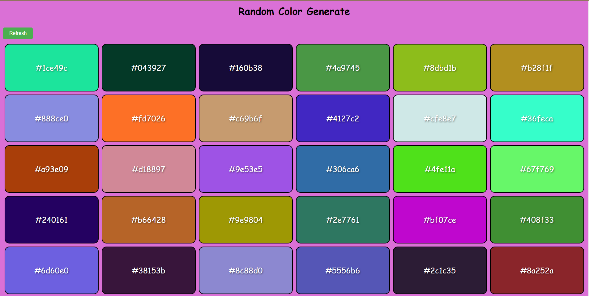
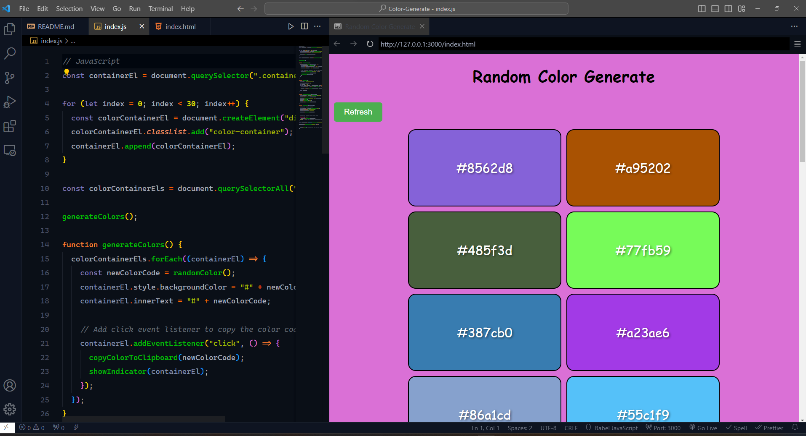
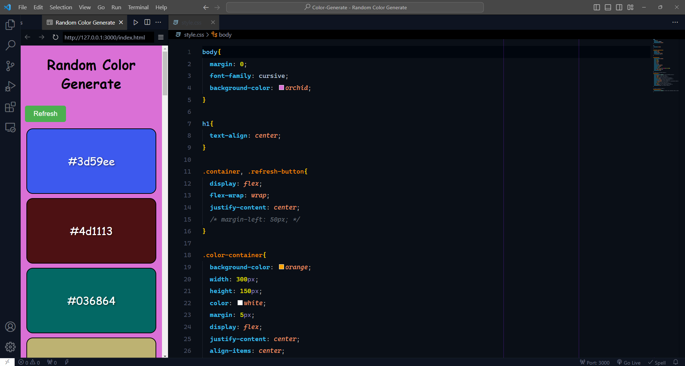

# Dynamic-Color-Palette-Generator

# Dynamic Color Palette Generator

This project creates a dynamic color palette by generating random colors and allowing you to copy their hex codes. It's a fun and visually appealing way to explore different colors for your projects.

## Usage

1. Open the `index.html` file in your web browser.
2. Click the "Refresh" button to generate a new set of random colors.
3. Click on any color to copy its hex code to your clipboard.
4. Explore and use these random colors for your design or development needs!

## Files

- `index.html`: The main HTML file.
- `style.css`: The CSS file for styling.
- `index.js`: The JavaScript file containing the color generation logic.

## How to Run

Simply open `index.html` in a web browser to start using the Dynamic Color Palette Generator.

Feel free to customize and extend this project according to your needs!
